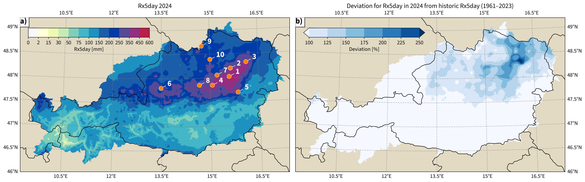
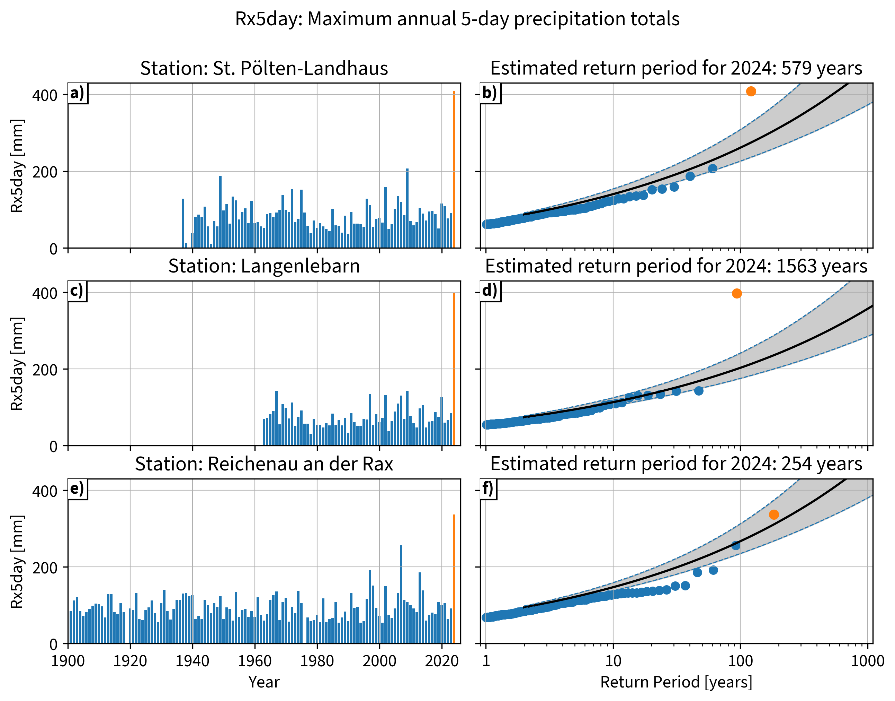

# Analysis of the September 2024 Extreme Precipitation Event in Austria

<!-- badges: start -->

    
    
    
    

<!-- badges: end -->

This repository supplements the manuscript by
Sebastian Lehner ,
Harald Schellander ,
Theresa Schellander-Gorgas ,
Matthias Schlögl  and
Klaus Haslinger  and
(2026):
**Brief communication: Contextualizing the September 2024 extreme precipitation in Austria within the climatological record**.
*EGUsphere* [Preprint]. <!-- Issue(Volume), pp-pp. [doi:](https://doi.org/#).-->

## Repository contents

### Setup

The symbolic link in the root directory of this repository for `dat` and the `DAT_DIR` variable within the `config.toml` need to be set accordingly and are just placeholder. They should point to the path of the data from Zenodo (see below).

### Data (`dat/`)

Data sourced from:

- All source data are precipitation totals with the unit $\left[\text{mm}\cdot\text{day}^{-1}\right]$, or equivalently $\left[\text{kg}\cdot\text{m}^{-2}\cdot\text{day}^{-1}\right]$
- Station data (TAWES):
    - Dataset: https://doi.org/10.60669/gs6w-jd70
    - Station IDs:
    - `[5625,5601,5604,5606,5607,5609,4080,4081,7110,10510,10511,6540,5410,5412,7000,7001,7002,1730,3520]`
    - Note that some stations have multiple IDs due to being slightly relocated over time. The latest ID is used for indexing.
- Gridded data (SPARTACUS):
    - Reference paper: https://doi.org/10.1007/s00704-017-2093-x
    - Dataset: https://doi.org/10.60669/5cqg-p427
- Persistent archive for processed data:
    - Dataset: https://doi.org/10.5281/zenodo.19346127

Processed data within this repository:

- `dat/station_locations.csv`: Station ID and coordinates in degrees (latitude, longitude)
- `dat/station_data.csv`: Unprocessed station data
- `dat/{rps|rls}.{json|csv}`: json output from extreme value analysis (return periods and levels)
- `dat/station_data_pivot.csv`: Pivoted (*wide*[^1]) table of station data (one column per station)
- `dat/station_data_pivot_rx5day.csv`: Rolling 5-day precipitation sums in the same wide format
- `dat/station_data_pivot_rx5day_year.csv`: Rx5day, which is the annual maximum of the rolling 5‑day precipitation sums in the same wide format

### Documents (`doc/`)

- `doc/tab1.tex`: Manuscript Table 1 (`tex`)
- `doc/fig1.png`: Figure 1: Map of 2024 Rx5day, deviation from historical records as [%], and station locations with their corresponding rank for the 12--16th September 2024 precipitation sums
- `doc/fig2.png`: Figure 2: Time series at selected stations with modeled and observed return periods
- `doc/area_affected.log`: logged calculation for % of area affected by new records
- `doc/suppl/`: subfolder containing plots similar to Fig1, but for the major summer floods pf 1997, 2002, 2005, and 2013

### Footnotes

[^1]: "Wide" table format: each station is a separate column, rows are aligned by time/index.
